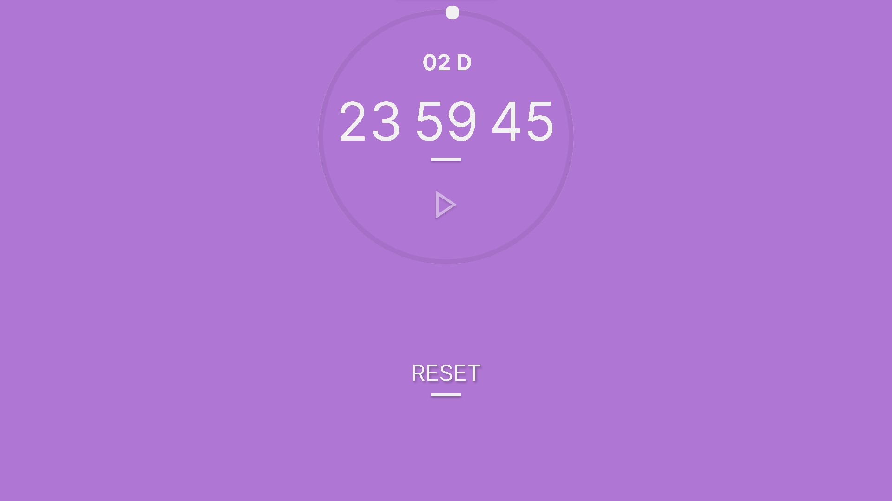

# Temporizador moderno e simples
##`Programado com Javascript puro`
##`Design montado por mim no Figma`
#

###Quando colocado as horas acima de 24 é contado os dias como mostra abaix0
#

#

[LINK DO SITE](https://rick-png.github.io/simple-timer/)
#
[DESIGN LINK](https://www.figma.com/file/986DoaACa3tYrbt3SCTMhw/Simple-Timer?node-id=0%3A1&t=uoXOBD90jl9fZbHf-1)

